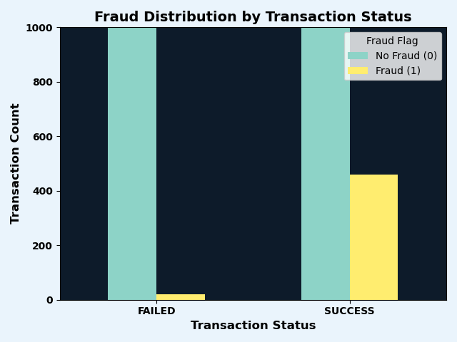

# 💳 Decoding UPI Transactions: Behavioral & Adoption Trends 2024

## 🎯 Project Objective
This project conducts an in-depth analysis of 2.5 lakh UPI transactions from 2024 to uncover user behaviour patterns, transaction dynamics (P2P vs P2M), peak usage periods, and bank-wise adoption trends. which factors influence users to complete or abandon transactions? Why do certain banks or user segments exhibit higher engagement?
By exploring these questions, actionable insights are drived to help digital payment platforms enhance user experience, optimize transaction completion, and drive greater adoption across diverse user segments.

---

## 📂 Dataset Information
- *Source:* Kaggle / Public Dataset- UPI Transactions 2024 Dataset
- *Dataset Link:* https://www.kaggle.com/datasets/skullagos5246/upi-transactions-2024-dataset
- *Rows used:* ~250,000 transactions  
- *Key columns:* transaction_id , timestamp , transaction_type, merchant_category, amount(INR), transaction_status, fraud_flag, sender_age_group, receiver_age_group, sender_state, sender_bank, receiver_bank, device_type, network_type, upi_app

  
> Note: dataset was cleaned (stripped, standardized, timestamp parsed), categorical orders fixed for plotting, and synthetic upi_app column added for richer analysis.

---

## 🛠 Analysis Steps
1. *Data cleaning & preprocessing*
   - Strip whitespace, standardize categories, convert datatypes.
   - Handle / drop invalid timestamps (where needed) and save cleaned CSV.
   - Map age groups into ordered categorical for plots.

2. *Exploratory Data Analysis (EDA)*
   - Transaction success vs failure counts & percentages.
   - Fraud distribution across: transaction type, merchant category, amount, time (hour/day/weekend), state, bank, app, device, network.
   - Boxplots & binned analysis for amounts (median & mode).
   - Crosstabs / groupby summaries and heatmaps for combined risk views.

3. *Focused risk analysis*
   - Fraud rate (%) per group (not just counts) to surface per-transaction risk.
   - Zoomed counts/limits where fraud is rare (so fraud bars remain visible).
   - Save key summary tables (fraud rates by bank, state, age group) to CSV for reporting.

---

## 📊 Analysis & Key Visualizations

### 1. 📈 Fraud Distribution by Transaction Status
   
The majority of fraudulent transactions were processed successfully, with over 450 cases slipping through undetected. Only a small fraction of fraud attempts failed, highlighting how easily fraudsters manage to exploit the system. This indicates a critical gap in fraud prevention at the transaction approval stage.
---

### 2. 🔍 Fraud by Transaction Type
  
*Insight:* Peer-to-Peer (P2P) transactions have the highest fraud count, while Recharge transactions — though fewer — show the *highest fraud rate (%)*.  
This means P2P frauds are volume-driven, while Recharges are disproportionately riskier.

---

### 3. 🛒 Fraud by Merchant Category
  
*Insight:* Grocery and Food merchants see the *highest fraud counts*, while Education has the lowest. Fraudsters target high-frequency, essential spends where small frauds may go unnoticed.

---

### 4. 🕒 Fraud by Time of Day
  
*Insight:* Fraud peaks *late at night (~4 AM)* and again *around 8 PM*.  
At night, fraudsters exploit low vigilance; in the evening, they hide within high transaction volumes. Weekends also show higher fraud rates per transaction.

---

### 5. 🏦 Fraud by Bank & UPI App
  
*Insight:* SBI shows the *highest fraud count* (both sender & receiver side).  
Among apps, *Paytm leads in fraud cases*, followed by PhonePe and GPay. This highlights where stronger fraud defenses are most urgently needed.

---

## 🔑 Key Findings
- Fraud is rare (≈0.2%) but concentrated: *P2P (by count), Recharge (by rate%), Grocery/Food (by count)*.  
- *26–35* most targeted; *Maharashtra/Karnataka* hotspots.  
- *SBI* & *Paytm* prominently present in fraud counts.  
- *Android + 4G* show higher failures & fraud counts.  
- Fraud mostly in *low–mid amounts (< ₹5,000)* (median ₹618, mode ₹162).

---

## 💡 Business Recommendations 
*P2P is the highest in fraud count. What next?*  
- Add velocity checks for repetitive transfers, flag repeated small transfers to new payees, and apply lightweight friction (e.g., contextual OTP) for suspicious flows.

*Recharge shows highest fraud rate% — how to secure it?*  
- Enforce OTP revalidation for rapid recharges and apply micro-transaction anomaly detection (velocity + device risk).

*26–35 age group is most targeted — should we act?*  
- Yes. Roll out targeted awareness nudges, in-app security tips, and optional stricter controls for newly added beneficiaries among this cohort.

*Maharashtra & Karnataka are hotspots — what can banks do?*  
- Deploy region-specific monitoring thresholds and local awareness campaigns; coordinate with regional risk teams.

*SBI and Paytm show high counts — how should stakeholders collaborate?*  
- Banks and apps should share anonymized signals (volume spikes, devicetypes, IP ranges) to block cross-platform fraud patterns.

*Android + 4G show more failures & frauds — what to implement?*  
- Improve app hardening, in-app device integrity checks, and encourage timely app/OS updates.

*Most frauds are < ₹5,000 — why monitor small transactions?*  
- Because many small frauds accumulate losses. Apply behavioral analytics even for micro-transactions.

*Time windows show peaks (late nights, evenings). What countermeasures help?*  
- Introduce time-aware risk multipliers and more aggressive real-time scoring during high-risk hours and weekends.

---

## 📌 Conclusion
This analysis of ~250k UPI transactions surfaces *where fraud hides and who it targets*: younger, active users, P2P flows, grocery/food merchants, Android + 4G users, and specific states/banks/apps. Though fraud is a tiny fraction (~0.2%), its patterns are consistent — enabling focused defenses that preserve user convenience while dramatically reducing risk.

---
